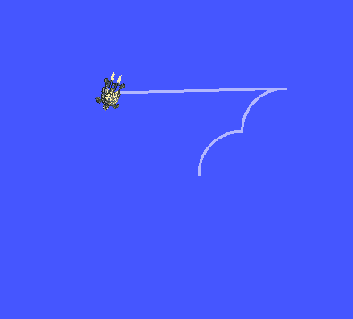

# `hor_d20_batman_turtle` package
ROS 2 C++ package.  [](https://docs.ros.org/en/humble/)

A package egy node-ból áll, ez a turtlesim szimulátorban képes a trajektóra kirajzolásával egy "Batman logo" előállítására. A hirdetett topic `geometry_msgs/twist` típusú. Megvalósítás `ROS 2 Humble` alatt.

This package consist of one node. The aim of the node is to draw a simplified "Batman logo". The type of the published topic is `geometry_msgs/twist`. This package builds in `ROS 2 Humble`.

## Packages and build

It is assumed that the workspace is `~/ros2_ws/`.

### Clone the packages
``` r
cd ~/ros2_ws/src
```
``` r
git clone https://github.com/horverno/hor_d20_batman_turtle
```

### Build ROS 2 packages
``` r
cd ~/ros2_ws
```
``` r
colcon build --packages-select hor_d20_batman_turtle --symlink-install
```

<details>
<summary> Don't forget to source before ROS commands.</summary>

``` bash
source ~/ros2_ws/install/setup.bash
```
</details>

``` r
ros2 launch hor_d20_batman_turtle demo.launch.py
```

``` r
ros2 run hor_d20_batman_turtle batman_draw
```




## Graph

The `/batman_draw` node publishes a `/turtle1/cmd_vel` topic (type: `geometry_msgs/Twist`) and ths simulator node (`/sim`) subscribes to the command topic.


``` r 
ros2 topic type /turtle1/cmd_vel

geometry_msgs/msg/Twist
```
